# Test report: SimWard pipeline prototype

Prototype: https://jevwithwind.github.io/simward/pipeline/
Tested on 2026-10-02 with headless Chromium (Playwright), served under `/simward/` exactly as GitHub Pages serves it. Result: **77 of 77 automated checks passed.** The only console errors were the Chatbase widget requests, which the test sandbox blocks.

## Assignment checklist (Part 4)

| Question from the brief | Result | How it was checked |
|---|---|---|
| Can you add, edit and delete items? | Yes | Requests: create, edit, close/reopen, delete with confirm. Candidates: add, run the Generator, edit details (method, rows), edit scores, delete. Reviews: book, edit, remove. |
| Does the status tracking work correctly? | Yes | A candidate was moved through every stage (Generated → Validation → Steward review → Approved → Released → withdrawn to Rejected → restored to Generated). Skipping a stage, entering review without scores and moving a released dataset are all blocked with a message. |
| Is the interface intuitive and visually coherent? | Yes | Same font and colours as the homepage, light by default, optional dark theme, visible keyboard focus, verb button labels, confirmation messages for every action. Screenshots below. |
| Does it handle edge cases? | Yes | Empty states (a request with no candidates, empty columns, no search results), very long text with no spaces, HTML typed into a form (shown as text), 60 extra candidates and 60 extra log entries, a 390px phone screen, corrupt saved data. |

## Problems found and fixed while testing

| Problem | Fix |
|---|---|
| Page scrolled sideways on a phone | Hidden screen-reader labels inside cards escaped the scrolling board; the board and cards now contain them. |
| Fifth pipeline column cut off on a 1280px laptop screen | Narrower minimum column width. |
| Arrow keys on the tabs moved from the wrong tab | Arrow keys now move from the focused tab. |
| Stage labels broke mid-word on a phone ("Genera/ted") | Stage strip uses three columns on small screens. |
| Page looked too dark | It followed the device's dark mode while the homepage has none. It now opens light, with an optional "Use dark theme" toggle that is remembered. |
| Heavy dark-teal buttons | Card and panel actions use a soft teal tint; only main page actions stay solid. |

## All automated checks

- [x] Seed: stage strip counts
- [x] Overview: needs-attention items (below min, validator not run, approved not released, empty request)
- [x] Overview: upcoming reviews listed
- [x] Overview: open-requests table with stacked bars and legend
- [x] Overview: clicking a stage opens the pipeline at that column
- [x] Request form: validation errors on empty submit
- [x] Request form: duplicate code rejected
- [x] Request: add
- [x] Request edit: out-of-range minimum rejected
- [x] Request: edit
- [x] Request: close hides it from the Open filter
- [x] Request: delete (with confirm)
- [x] Generator: loading state on button
- [x] Generator: creates SYN-STF-01 with method and 20k–80k rows
- [x] Validate: moves to Validation and auto-runs Validator (loading state)
- [x] Validator: assigns scores in the method range
- [x] Card: score strip with ticks
- [x] Edit scores: manual override logged
- [x] Move: Validation → Steward review
- [x] Sign-off: steward name and checkbox required
- [x] Move: Steward review → Approved (sign-off recorded)
- [x] Release dialog shows who signed off
- [x] Move: Approved → Released
- [x] Released is locked: no Back button
- [x] Released is locked: drag back shows toast
- [x] Withdraw: reason required
- [x] Move: Released → Rejected via Withdraw
- [x] Rejected hidden by default
- [x] Show rejected toggle reveals the column
- [x] Restore: Rejected → Generated
- [x] Drag skip-stage blocked with next valid stage named
- [x] Steward review requires scores
- [x] Drag and drop forward one stage works (and auto-validates)
- [x] Back from Approved withdraws sign-off
- [x] Sign-off blocked when privacy fails (no Sign off button)
- [x] Blocked dialog offers Reject with pre-filled reason
- [x] Escape closes dialog
- [x] Decision note required for below-minimum scores
- [x] Sign-off with note succeeds
- [x] Score edit that fails privacy withdraws sign-off and logs why
- [x] Panel: save steward review notes
- [x] Escape closes the panel
- [x] Reviews: schedule dialog books a session
- [x] Reviews: upcoming and past lists
- [x] Reviews: notice lists review-stage candidates with no session
- [x] Audit: newest first
- [x] Audit: search filters entries
- [x] Audit: actor tags styled by type
- [x] Persistence: data survives reload
- [x] Escaping: user text rendered as text, not HTML
- [x] Many items + long text: no sideways scroll at 1280 on overview
- [x] Many items + long text: no sideways scroll at 1280 on pipeline
- [x] Many items + long text: no sideways scroll at 1280 on requests
- [x] Many items + long text: no sideways scroll at 1280 on reviews
- [x] Many items + long text: no sideways scroll at 1280 on audit
- [x] Card request title clamps to 2 lines
- [x] Audit: many entries paginated (Show 100 more)
- [x] 390px: no sideways page scroll on overview (with many items)
- [x] 390px: no sideways page scroll on pipeline (with many items)
- [x] 390px: no sideways page scroll on requests (with many items)
- [x] 390px: no sideways page scroll on reviews (with many items)
- [x] 390px: no sideways page scroll on audit (with many items)
- [x] 390px: panel fits the screen
- [x] About dialog: mapping table and fictional-data notice
- [x] Reset demo data restores seed
- [x] Corrupt storage: falls back to seed with a notice
- [x] Keyboard: arrow keys move between tabs
- [x] Keyboard: visible focus outline
- [x] Overview: hiring-assistant mapping visible
- [x] Theme: stays light when the OS is in dark mode
- [x] Theme: toggle switches to dark
- [x] Theme: dark choice persists after reload
- [x] Theme: toggle back to light
- [x] Candidate: edit details (method, rows)
- [x] Reduced motion: panel opens without animation
- [x] Homepage footer link opens the prototype
- [x] No console errors (excluding blocked third-party requests)

## Screenshots

| | |
|---|---|
| 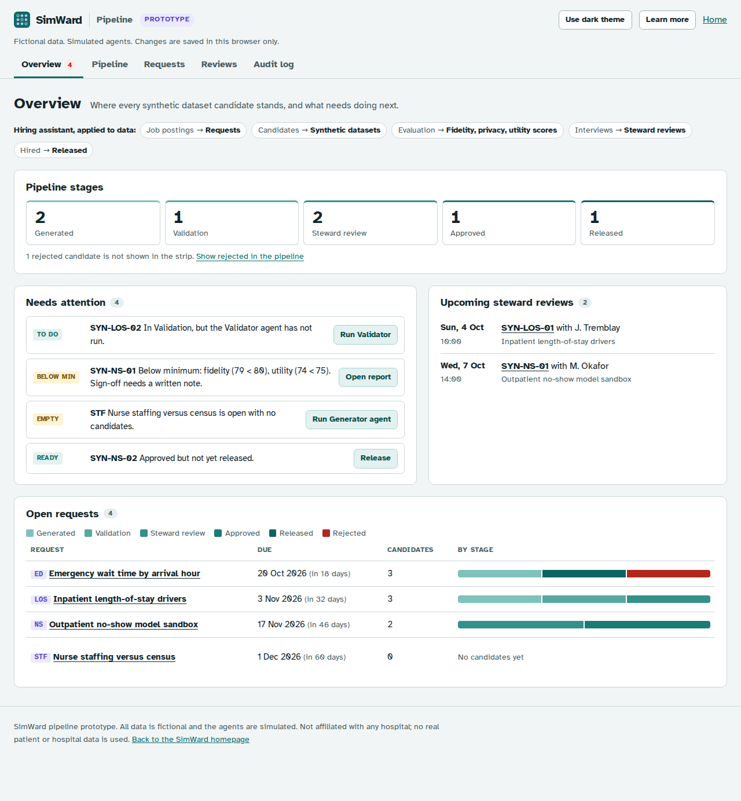 Overview | 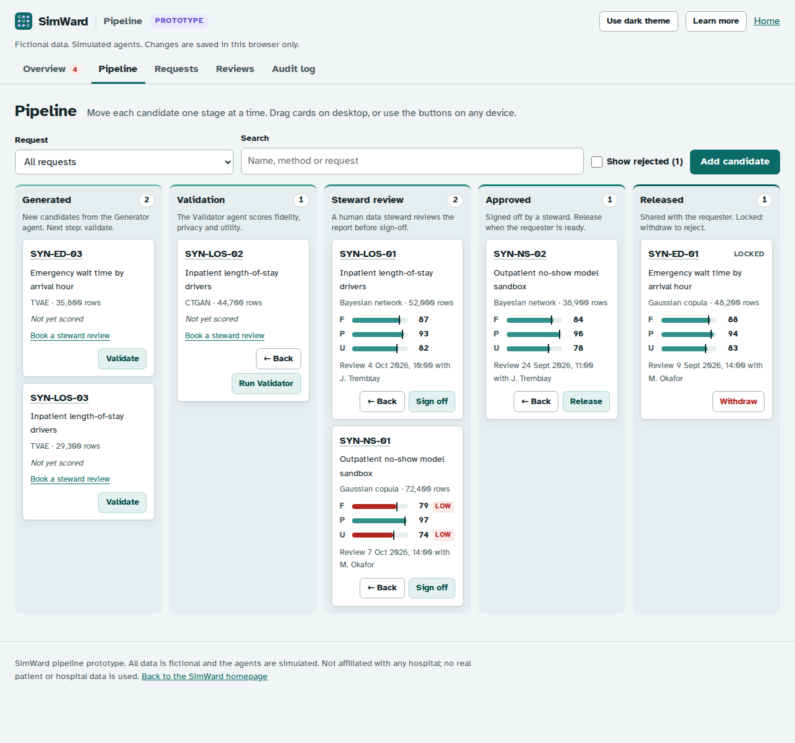 Pipeline board |
| 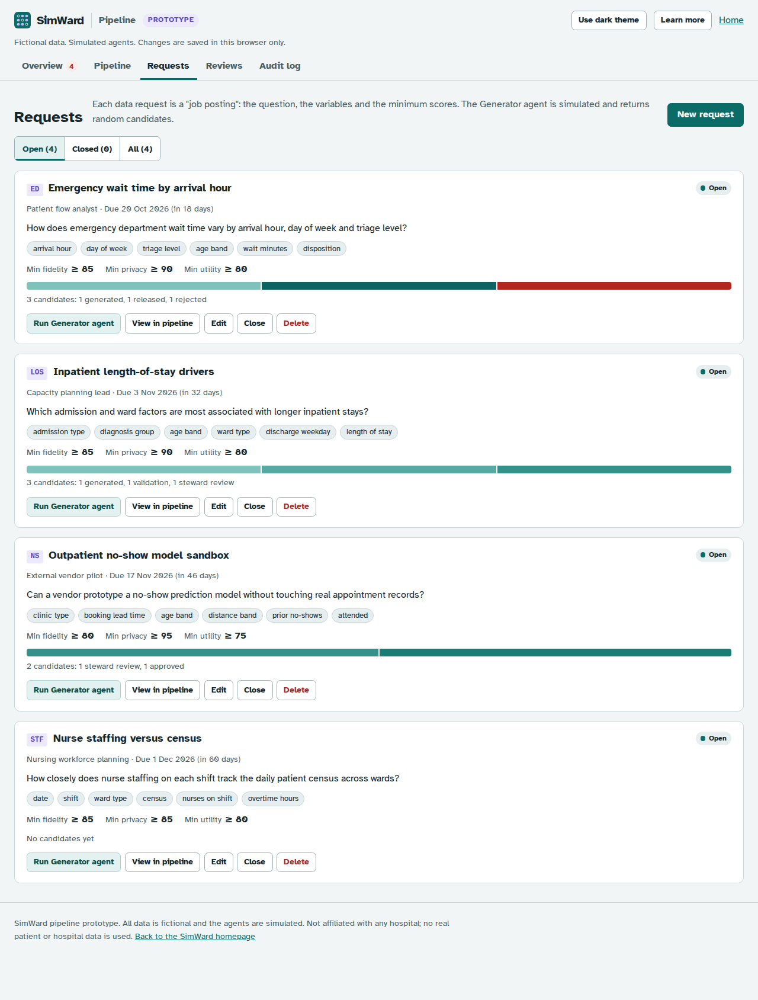 Requests | 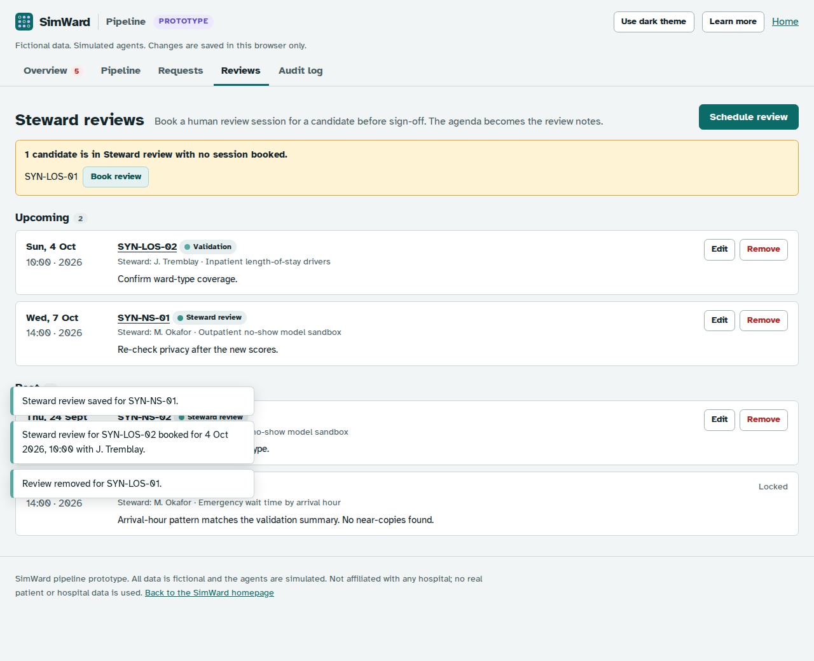 Steward reviews |
| 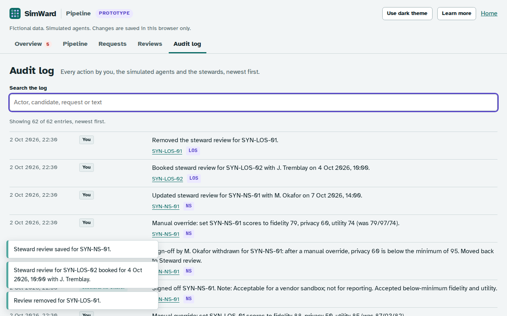 Audit log | 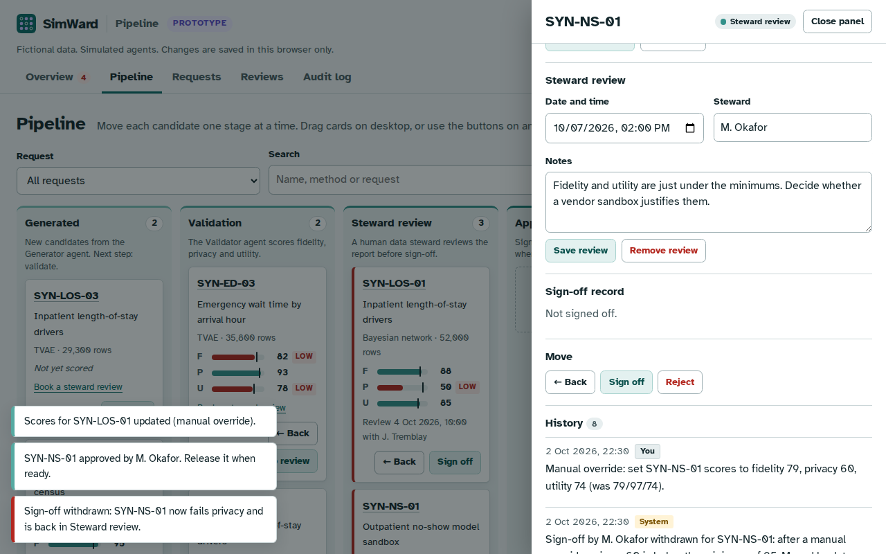 Candidate panel |
| 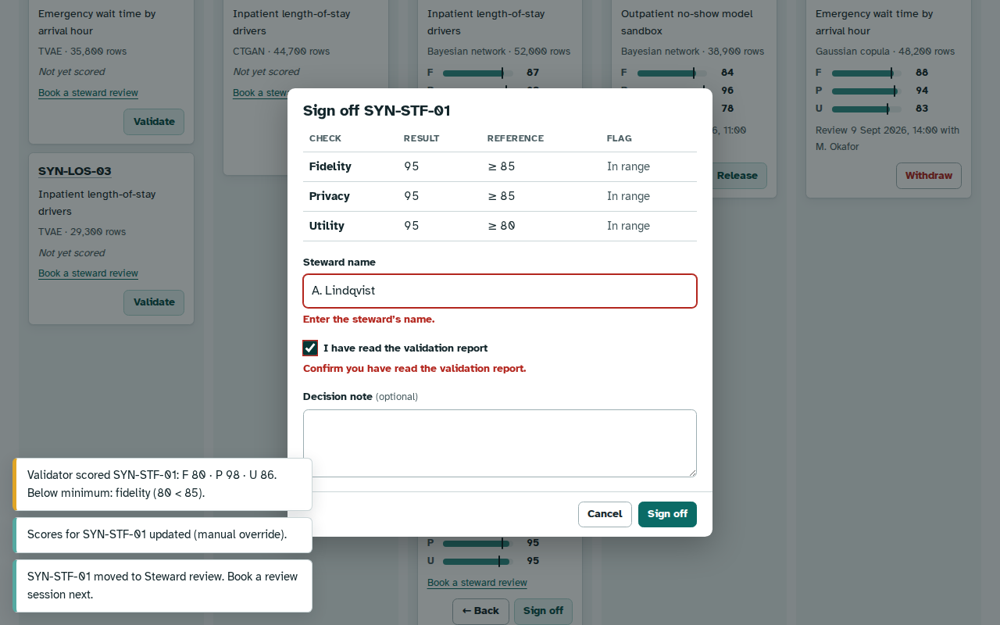 Sign-off dialog | 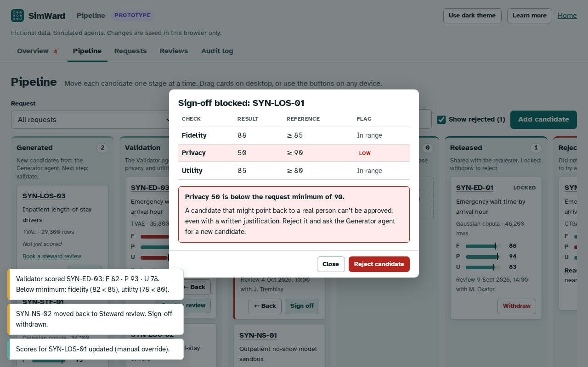 Sign-off blocked by privacy |
| 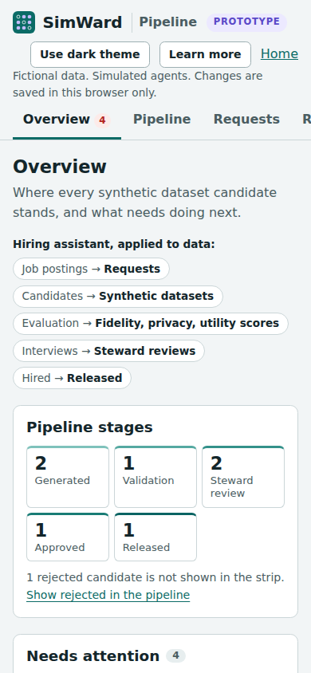 Phone, overview | 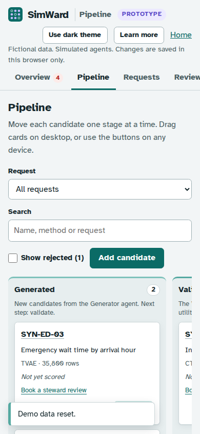 Phone, pipeline |
| 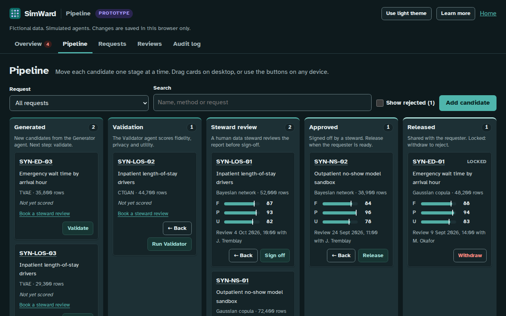 Optional dark theme | |
